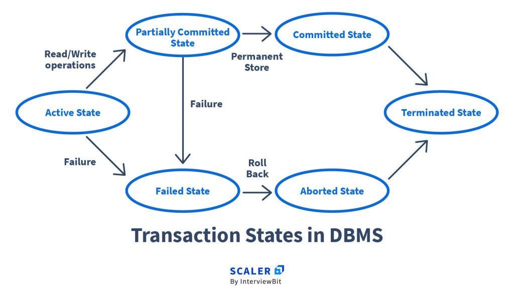

# Transactions processing and Concurrency Control [6 hours] [12 marks]

## Transactions

Transaction is a single logical unit of work that consists of multiple SQL operations which access and possibly modifies the contents of the database. It must either complete fully or not execute at all.

- e.g., transferring money from Account A to Account B involves: debit A + credit B — both must succeed together or neither should happen.

### ACID Properties

A transaction in database must maintain Atomicity, Consistency, Isolation and Durability commonly known as ACID properties.

**A — Atomicity**

- The entire transaction is treated as one unit — either *all operations execute* or *none do*
- If any step fails, the whole transaction is rolled back
- e.g., if debit succeeds but credit fails → rollback the debit too, leaving both accounts unchanged

**C — Consistency**

- A transaction must bring the database from one *valid state* to another valid state
- All integrity constraints must hold before and after the transaction
- e.g., total balance before transfer = total balance after transfer — money is neither created nor lost

**I — Isolation**

- Concurrent transactions execute *independently* without interfering with each other
- Intermediate states of a transaction are not visible to other transactions
- e.g., if two people withdraw from the same account simultaneously, one must wait until the other completes — no overlap

**D — Durability**

- Once a transaction is committed, changes are *permanent* even if the system crashes
- Data is saved to non-volatile storage (disk) and can be recovered
- e.g., after a successful bank transfer, even if the server crashes immediately after, the transfer remains recorded

### Transaction States

**Active** — transaction is currently executing (read/write operations in progress)

**Partially Committed** — last operation has executed but changes not yet saved to disk

**Committed** — all operations completed successfully, changes permanently saved

**Failed** — an error occurred, normal execution cannot proceed

**Aborted** — transaction rolled back, database restored to state before transaction began

**Terminated** — transaction has ended (either after commit or abort), removed from system

## Concurrency

The allowance to run multiple transactions in the system is known as concurrent executions.

### Advantages

- Increased processor and disk utilization.
- Reduced average response time.

### Problems of Concurrency

**Lost Update**

- Occurs when two transactions read the same data and both update it — the second update overwrites the first, causing the first update to be **lost**
- Neither transaction is aware of the other's changes

| T1 | T2 |
|---|---|
| Read A = 100 | |
| | Read A = 100 |
| A = A + 50 → Write 150 | |
| | A = A - 30 → Write 70 |

- T1's update (150) is lost because T2 read the old value and overwrote it with 70. Correct answer should be 120.

**Dirty Read (Uncommitted Changes)**

- Occurs when a transaction reads data that has been **modified but not yet committed** by another transaction
- If the first transaction rolls back, the second transaction has read invalid/non-existent data

| T1 | T2 |
|---|---|
| A = 100, Write A = 200 | |
| | Read A = 200 (dirty) |
| ROLLBACK → A = 100 | |
| | Uses A = 200 ← wrong |

- T2 read uncommitted data that was later rolled back — T2 now has a value that never officially existed

**Unrepeatable Read (Inconsistent Retrieval)**

- Occurs when a transaction reads the **same data twice** but gets different values because another transaction modified and committed it in between
- The first transaction sees inconsistent data within its own execution

| T1 | T2 |
|---|---|
| Read A = 100 | |
| | Read A = 100, Write A = 200, COMMIT |
| Read A = 200 | |

- T1 reads A twice within the same transaction and gets different values (100 then 200) — the read is not repeatable

### Concurrency Control Protocols

**1. Lock-Based Protocol**

- Transactions must acquire a **lock** on a data item before accessing it
- Ensures no two transactions access the same data in a conflicting way simultaneously

Two types of locks:

- **Shared lock (S)** — for reading; multiple transactions can hold shared lock on same item
- **Exclusive lock (X)** — for writing; only one transaction can hold it, no other lock allowed

**2. Timestamp-Based Protocol**

- Each transaction is assigned a unique **timestamp** when it starts (older transaction = smaller timestamp)
- Every data item stores two values: **read timestamp** and **write timestamp** of last access
- If a transaction tries to access data in a way that violates timestamp order → it is **rolled back and restarted** with a new timestamp

Rules:

- T can read item X only if `TS(T) ≥ write_TS(X)` (not reading future writes)
- T can write item X only if `TS(T) ≥ read_TS(X)` and `TS(T) ≥ write_TS(X)`
- No deadlock since transactions are never made to wait — just rolled back

**3. Validation-Based Protocol (Optimistic)**

- Assumes conflicts are **rare** — transactions execute freely without locking
- Validation is done at the end before commit
- Three phases:
  - **Read phase** — transaction reads and executes, writes to temporary local variables only
  - **Validation phase** — checks if any conflict occurred with other committed transactions
  - **Write phase** — if validation passes, changes are written to database; otherwise rolled back

- Best suited for **read-heavy** workloads with low conflict probability

### Lock-Based Protocol — 4 Types

**Simplistic Lock Protocol**

- Transaction locks data before accessing and unlocks after use
- No rules on when to lock/unlock — does not guarantee serializability

**Pre-claiming Lock Protocol**

- Transaction locks **all required data items before it begins execution**
- If any lock is unavailable, transaction waits — prevents deadlock but reduces concurrency

#### Two-Phase Locking (2PL)

A transaction must acquire all locks before releasing any lock. Divided into two phases:

**Growing Phase:**

- Transaction acquires all needed locks (S or X)
- Cannot release any lock during this phase
- Continues until it reaches the **lockpoint** (maximum locks held)

**Shrinking Phase:**

- Transaction starts releasing locks
- Cannot acquire any new lock during this phase

**How it ensures Serializability:**

- The lock point of each transaction defines an order
- Execution is equivalent to serial execution in the order of lock points
- No two conflicting transactions can overlap their access — one must wait until the other releases, ensuring conflict serializability

**Problem with 2PL:**

- Can cause **deadlock** — T1 waits for T2's lock, T2 waits for T1's lock → neither proceeds
- Can cause **cascading rollback** — if T1 releases a lock early and T2 reads that data, then T1 aborts → T2 must also abort

#### Strict 2PL

Same as 2PL but with one additional rule:

- **All exclusive (X) locks must be held until the transaction commits or aborts** — shared locks can still be released early

**How it works:**

- Growing phase same as 2PL — acquire all locks
- During shrinking phase — shared locks can be released, but exclusive locks are held until the very end
- Only after COMMIT or ABORT, all exclusive locks are released at once

**How it ensures Serializability:**

- Since exclusive locks are held until commit, no other transaction can read or write uncommitted data
- Eliminates **dirty reads** completely
- Eliminates **cascading rollbacks** — no transaction reads data that might be rolled back
- Guarantees both **conflict serializability** and **recoverability**

**Strict 2PL vs 2PL:**

| 2PL | Strict 2PL |
|---|---|
| Locks released during shrinking phase | X locks held until commit/abort |
| Cascading rollback possible | Cascading rollback not possible |
| Dirty read possible | Dirty read not possible |
| Less strict | More strict and safer |

### Pitfalls of Lock-Based Protocol

- **Deadlock** — two transactions wait for each other's locks indefinitely, neither can proceed
- **Starvation** — a transaction keeps getting rolled back repeatedly and never gets to execute
- **Reduced concurrency** — long lock holds block other transactions, reducing parallel performance
- **Cascading rollback** — if T1 releases lock early and T2 reads it, T1 abort forces T2 to abort too
- **Overhead** — maintaining lock tables requires extra memory and processing cost

## Graph-Based Protocol

An alternative to 2PL that uses a **directed graph (database graph)** to define the order in which data items can be locked.

**How it works:**

- All data items are organized in a **partial order** represented as a directed graph
- If there is an edge A → B, any transaction that locks B must have locked A first
- Transactions must lock data items following this predefined order only

**Most common: Tree Protocol**

- Database graph is restricted to a **tree structure**
- Rules:
  - First lock can be on **any node** in the tree
  - After that, a node can only be locked if its **parent is currently locked**
  - Nodes can be **unlocked at any time** (unlike 2PL, no shrinking phase restriction)
  - A node that is unlocked **cannot be re-locked** by the same transaction

**Advantages over 2PL:**

- **No deadlock** — locking order is predefined, circular wait cannot occur
- Locks can be released earlier → **better concurrency** than 2PL

**Disadvantages:**

- Transaction must lock nodes it doesn't need just to follow the tree path → **unnecessary locking**
- Does not guarantee **recoverability** on its own
- Requires prior knowledge of which data items will be accessed

### Granularity of Locking

**Granularity** — the size of the data item on which a lock is applied.

**Fine Granularity (Small lock size)**

- Locks applied at row/tuple level
- High concurrency — multiple transactions work on different rows simultaneously
- High overhead — many locks to manage and track

**Coarse Granularity (Large lock size)**

- Locks applied at table or database level
- Low overhead — fewer locks to manage
- Low concurrency — locking entire table blocks all other transactions even if they need different rows

**Granularity Levels (finest to coarsest):**

- Field → Row/Tuple → Page → Table → Database

**Tradeoff:**

| Fine Granularity | Coarse Granularity |
|---|---|
| High concurrency | Low concurrency |
| High locking overhead | Low locking overhead |
| Better for large databases | Better for small/simple databases |

- Ideal choice depends on workload — **read-heavy large systems** prefer fine, **simple low-traffic systems** prefer coarse

### Lock Compatibility Matrix

Shows whether two locks can be held on the same data item simultaneously:

| | S (Shared) | X (Exclusive) |
|---|---|---|
| **S (Shared)** | ✓ Compatible | ✗ Incompatible |
| **X (Exclusive)** | ✗ Incompatible | ✗ Incompatible |

- **S + S** — allowed; multiple transactions can read simultaneously
- **S + X** — not allowed; can't read and write at same time
- **X + S** — not allowed; writer blocks all readers
- **X + X** — not allowed; only one writer at a time

### Conflict Serializability

## Deadlock in DBMS

**What it is:** A situation where two or more transactions are waiting for each other to release locks — none can proceed, all are stuck indefinitely.

**How it arises:**

- T1 holds lock on A, wants lock on B
- T2 holds lock on B, wants lock on A
- Both wait forever → deadlock

| T1 | T2 |
|---|---|
| Lock(A) | Lock(B) |
| Wait for B... | Wait for A... |
| ← stuck → | ← stuck → |

Four conditions that must hold simultaneously (Coffman's conditions):

- **Mutual exclusion** — resource held exclusively by one transaction
- **Hold and wait** — transaction holds one lock and waits for another
- **No preemption** — locks cannot be forcibly taken away
- **Circular wait** — T1 waits for T2, T2 waits for T1 (circular chain)

### Deadlock Prevention Strategies

**Wait-Die (Non-preemptive)**

- Older transaction waits for younger to release lock
- If younger requests lock held by older → younger is killed (dies) and restarted
- Older transactions never die, younger ones may die multiple times

**Wound-Wait (Preemptive)**

- Older transaction **wounds** (forces rollback) the younger one holding the lock
- Younger transaction waits if it requests a lock held by an older one
- Older transactions are never rolled back

**Timeout-Based**

- Transaction is rolled back if it waits longer than a set timeout period
- Simple to implement but hard to set the right timeout value

**Pre-claiming (Lock All in Advance)**

- Transaction locks all required data before starting
- If any lock unavailable → waits without holding anything
